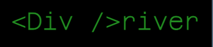
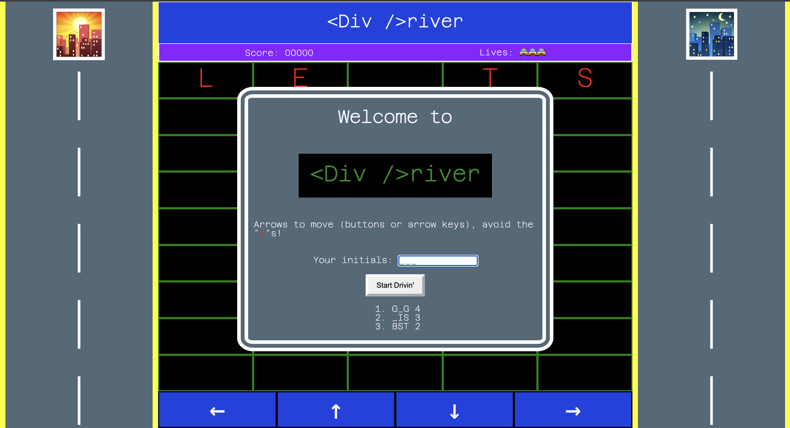
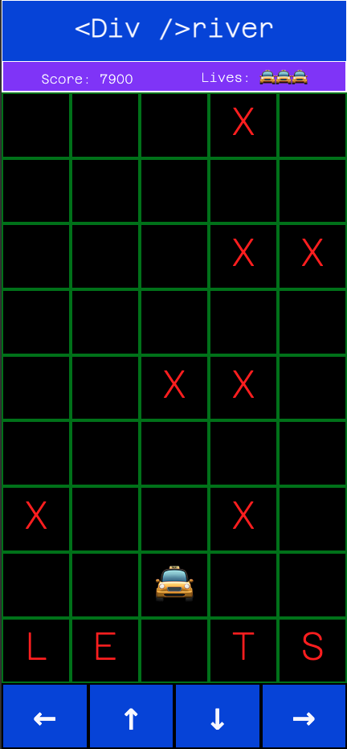

# Div_Driver

## Figma link (some preplanning, not complete):
[Figma file](https://embed.figma.com/design/G5T4DzZ2IkkOKNJNIIdpUI/Div-Driver?node-id=0-1&embed-host=share")

## What type of game is DivDriver?
Div driver is a grid based driving game where the player avoids an endless randomly generated collection of obsticles. Inspiration was from the videogame spyhunter(Arcade, 1983) and other similar top down car games.

## Getting started:
Link: [Github](https://gabe-n-g.github.io/Div_Driver/)

Instructions: 

* Insert your intials (limit 3) and hit the start button to begin.

* Avoid red X's. Movement is done with either the arrow keys or by clicking or touching the buttons at the bottom of the screen.

* Game over is when you crash 3 times by either colliding with x's or leaving the game board. Lives and score are recorded on the top of the screen.

## MVP and stretch goals

### MVP + Deliverables -

* Player can control car with on screen buttons (mobile + desktop)/Keyboard buttons (desktop)
* Both the playing field and control of the car is simple grid based.
* Game board updates with obstacles that move towards player.
* Game is over when obstacle intersects with player car.
* Game also ends if player car leaves playable zone.

### Stretch (from ultra basic to more advanced)

* Basic refactoring/debugging/simplifying
    * Example: because of the way I coded both movement/collision checking, there is a bit of unintended consequences when crashing the car and the car flickers as it moves across the board.

* Making the the board iteraviely through JS instead of static with text changing in JS.

* Score is kept by how many seconds the car is running without crashing.
* Player can insert initials and high scores will be recorded at game over. Game will display top 3 scores.
* Obstacles will be generated at random instead of being preset.
* Obstacles will move towards the car faster and spawn more frequently as game goes on.
* No checkmate situations - no obstacle spawns that the player cannot move through.
* Player will have 3 lives

* Game has music/sound effects

* Desktop view shows additional information (full highscore list/player speed)
* Player will get an extra life at set scores.
* Bonus tokens will spawn on map that give extra score.
* Changes in course instead of just random obstacles
* Add localstorage for high scores. Make desktop view 10 high scores.

## Attributions:

Music: "Move me" from the Ridge Racer Type 4 soundtrack (track 17)
Namco "R4 -Ridge Racer Type 4-" Sound Team
    Kohta Takahashi: 1, 7, 13, 17, 18
    Hiroshi Okubo: 2, 3, 5, 6, 12, 14, 19, 22~25
    Asuka Sakai: 4, 8, 11, 14, 20, 21
    Tetsukazu Nakanishi: 9, 15
    Koji Nakagawa: 10,16
https://archive.org/details/r4ridgeracertype4directaudioflac/17-Move+Me.flac

Game over noise from From Sega Rally Championship (Sega, 1995, SAT):
https://downloads.khinsider.com/game-soundtracks/album/competition-sega-rally-championship-complete-1996

Car crash noise from Frogger (1981):
https://www.computerarcheology.com/Arcade/Frogger/

Car start noise
https://www.videvo.net/royalty-free-sound-effects/peel-out/

## Technologies used:
Html / CSS / Javascript
Figma (for preplanning)
Gridbox/Flexbox

## Screenshots:

### Desktop:

### Mobile:

